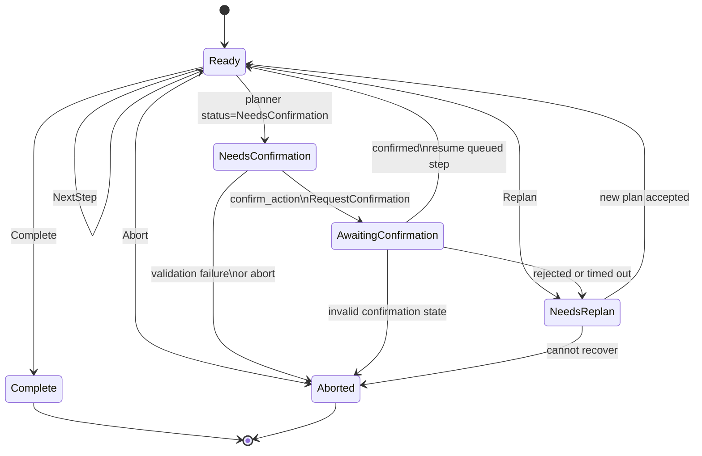

# SPECS.md

## v1 Module-Level Specification

### Overview
Low-resource desktop web-reading assistant for vision-impaired users.

- Rust + Tauri
- Follow standard Tauri app conventions for project structure
- CPU-first
- Visible or headless browser modes
- DOM-first extraction, OCR fallback
- Chromium backend via chromiumoxide
- Push-to-talk (wake word deferred to v2)
- Voice-first control; no keyboard or mouse required for normal operation

---

## Core Components

### App Core
- Orchestrates modules
- Handles lifecycle and routing

### Config
- Stores user settings (TOML)
- Stores provider selection for planner, TTS, and ASR
- Stores local model preferences and remote API configuration references
- Stores failover preferences where supported
- Stores persistent audio settings including playback volume and playback speed

## Provider Configuration Schema

Provider configuration should live in the main TOML config and describe provider choice, model/profile selection, and how secrets are resolved.

### Top-Level Shape

```toml
[providers.planner]
mode = "remote"
remote_profile = "openai-default"

[providers.tts]
mode = "local"
remote_profile = "openai-tts-default"
local_profile = "kitten-default"

[providers.asr]
mode = "local"
remote_profile = "openai-transcribe-default"
local_profile = "whisper-default"

[safety]
confirmation_confidence_threshold = 0.90
allow_click_without_confirmation = true
always_confirm_submit = true

[ocr]
trigger_on_no_extractable_text = true
sparse_text_char_threshold = 200
sparse_text_region_threshold = 2
prefer_region_ocr = true

[models]
models_dir = "~/.config/blind_browser/models"
check_on_startup = true
auto_download_missing = false

[speech_feedback]
style = "short"
confirm_setting_changes = true
include_previous_value = false

[remote_profiles.openai-default]
provider = "openai"
base_url = "https://api.openai.com/v1"
model = "gpt-5.4-mini"
api_key = { from_env = "OPENAI_API_KEY" }
temperature = 0.2
max_output_tokens = 1024
timeout_ms = 30000

[remote_profiles.openai-tts-default]
provider = "openai"
base_url = "https://api.openai.com/v1"
model = "gpt-4o-mini-tts"
api_key = { from_env = "OPENAI_API_KEY" }
voice = "alloy"
audio_format = "wav"
timeout_ms = 30000

[remote_profiles.openai-transcribe-default]
provider = "openai"
base_url = "https://api.openai.com/v1"
model = "gpt-4o-mini-transcribe"
api_key = { from_env = "OPENAI_API_KEY" }
language = "en"
temperature = 0.0
timeout_ms = 30000

[local_profiles.kitten-default]
backend = "kitten_tts_rs"
model_id = "default"
model_path = "/path/to/kitten/model"
default_voice = "Bruno"
sample_rate = 24000

[local_profiles.whisper-default]
backend = "whisper"
model_id = "tiny"
model_path = "/path/to/whisper/model"
language = "en"
threads = 4
```

### Schema Types

```rust
struct AppConfig {
  providers: ProviderSelections,
  remote_profiles: RemoteProfiles,
  local_profiles: LocalProfiles,
  audio: AudioSettings,
  safety: SafetySettings,
  ocr: OcrSettings,
  models: ModelManagementSettings,
  speech_feedback: SpeechFeedbackSettings,
}

struct ProviderSelections {
  planner: ProviderSelection,
  tts: ProviderSelection,
  asr: ProviderSelection,
}

struct ProviderSelection {
  mode: ProviderMode,
  remote_profile: Option<String>,
  local_profile: Option<String>,
}

enum ProviderMode {
  Local,
  Remote,
}

struct RemoteProfiles {
  planner: std::collections::BTreeMap<String, RemotePlannerProfile>,
  tts: std::collections::BTreeMap<String, RemoteTtsProfile>,
  asr: std::collections::BTreeMap<String, RemoteAsrProfile>,
}

struct RemotePlannerProfile {
  provider: RemoteProviderKind,
  base_url: String,
  model: String,
  api_key: SecretRef,
  organization: Option<SecretRef>,
  project: Option<String>,
  temperature: f32,
  max_output_tokens: u32,
  timeout_ms: u64,
}

struct RemoteTtsProfile {
  provider: RemoteProviderKind,
  base_url: String,
  model: String,
  api_key: SecretRef,
  organization: Option<SecretRef>,
  project: Option<String>,
  voice: String,
  audio_format: TtsAudioFormat,
  timeout_ms: u64,
}

struct RemoteAsrProfile {
  provider: RemoteProviderKind,
  base_url: String,
  model: String,
  api_key: SecretRef,
  organization: Option<SecretRef>,
  project: Option<String>,
  language: Option<String>,
  temperature: f32,
  timeout_ms: u64,
}

enum RemoteProviderKind {
  OpenAi,
}

struct LocalProfiles {
  planner: std::collections::BTreeMap<String, LocalPlannerProfile>,
  tts: std::collections::BTreeMap<String, LocalTtsProfile>,
  asr: std::collections::BTreeMap<String, LocalAsrProfile>,
}

struct LocalPlannerProfile {
  backend: LocalBackendKind,
  model_id: String,
  quantization: String,
  model_path: String,
  context_window: u32,
  temperature: f32,
  max_output_tokens: u32,
  threads: u16,
}

struct LocalTtsProfile {
  backend: LocalBackendKind,
  model_id: String,
  model_path: String,
  default_voice: String,
  sample_rate: u32,
}

struct LocalAsrProfile {
  backend: LocalBackendKind,
  model_id: String,
  model_path: String,
  language: Option<String>,
  threads: u16,
}

enum LocalBackendKind {
  LlamaCpp,
  KittenTtsRs,
  Whisper,
}

enum TtsAudioFormat {
  Wav,
  Mp3,
  Flac,
}

struct AudioSettings {
  playback_volume: f32,
  playback_speed: f32,
}

struct SafetySettings {
  confirmation_confidence_threshold: f32,
  allow_click_without_confirmation: bool,
  always_confirm_submit: bool,
}

struct OcrSettings {
  trigger_on_no_extractable_text: bool,
  sparse_text_char_threshold: usize,
  sparse_text_region_threshold: usize,
  prefer_region_ocr: bool,
}

struct ModelManagementSettings {
  models_dir: String,
  check_on_startup: bool,
  auto_download_missing: bool,
}

enum SpokenFeedbackStyle {
  Short,
  Verbose,
}

struct SpeechFeedbackSettings {
  style: SpokenFeedbackStyle,
  confirm_setting_changes: bool,
  include_previous_value: bool,
}
```

### Secret Reference Shape

Secrets should be referenced, not embedded directly in the primary config, whenever possible.

```rust
enum SecretRef {
  FromEnv { from_env: String },
  FromFile { from_file: String },
  Inline { inline: String },
}
```

Recommended precedence for secrets:

1. environment variable reference
2. file reference
3. inline secret only as a last resort

### Secret Handling Rules

- The main config should prefer `from_env` for API keys.
- `from_file` is acceptable for local deployments where environment management is inconvenient.
- `inline` secrets should be supported only for development or explicit user choice.
- Secrets must never be written to logs.
- The UI should mask secret values and avoid echoing them after initial entry.
- Example configs should use `from_env`, not inline keys.

### Validation Rules

- `providers.planner.mode = "remote"` requires `remote_profile`.
- `providers.planner.mode = "local"` requires `local_profile`.
- `tts` and `asr` may omit failover in v1.
- Every referenced profile name must exist within the matching provider category.
- Planner selections may only reference planner profiles; TTS selections may only reference TTS profiles; ASR selections may only reference ASR profiles.
- `base_url` must be absolute for all remote profiles.
- `temperature` should be clamped to a supported range such as $0.0$ to $2.0$.
- `timeout_ms` must be positive for all remote profiles.
- `max_output_tokens` must be positive for planner profiles.
- `model_path` is required for all local profiles in v1.
- `threads` must be positive for local ASR profiles.
- `sample_rate` must be positive for local TTS profiles.
- `playback_volume` should be clamped to a safe range such as $0.0$ to $1.0$.
- `playback_speed` should be clamped to a supported range such as $0.5$ to $5.0$.
- `confirmation_confidence_threshold` should be clamped to a range such as $0.0$ to $1.0$.
- `always_confirm_submit` must remain `true` in v1.
- `models_dir` should default to a `models` folder adjacent to the config file.

### v1 Defaults

- Planner default mode: `remote`
- Planner remote profile: `openai-default`
- Planner failover: enabled when local model is configured
- TTS default mode: `local`
- TTS local profile: `kitten-default`
- ASR default mode: `local`
- ASR remote profile: `openai-transcribe-default`
- ASR local profile: `whisper-default`
- Playback volume default: `1.0`
- Playback speed default: `1.0`
- Confirmation confidence threshold default: `0.90`
- Clicks allowed without confirmation by default: `true`
- Submit actions always require confirmation: `true`
- OCR sparse text character threshold default: `200`
- OCR sparse text region threshold default: `2`
- Model directory default: `~/.config/blind_browser/models`
- Speech feedback style default: `short`

### Shipped Example Config

The application should ship an example user-facing config using the following profile names and defaults.

Suggested file location:
- user config: `~/.config/blind_browser/config.toml`
- example template shipped with app/docs: `config.example.toml`

Exact initial example contents:

```toml
[providers.planner]
mode = "remote"
remote_profile = "openai-default"

[providers.tts]
mode = "local"
remote_profile = "openai-tts-default"
local_profile = "kitten-default"

[providers.asr]
mode = "local"
remote_profile = "openai-transcribe-default"
local_profile = "whisper-default"

[audio]
playback_volume = 1.0
playback_speed = 1.0

[safety]
confirmation_confidence_threshold = 0.90
allow_click_without_confirmation = true
always_confirm_submit = true

[ocr]
trigger_on_no_extractable_text = true
sparse_text_char_threshold = 200
sparse_text_region_threshold = 2
prefer_region_ocr = true

[models]
models_dir = "~/.config/blind_browser/models"
check_on_startup = true
auto_download_missing = false

[speech_feedback]
style = "short"
confirm_setting_changes = true
include_previous_value = false

[remote_profiles.planner.openai-default]
provider = "openai"
base_url = "https://api.openai.com/v1"
model = "gpt-5.4-mini"
api_key = { from_env = "OPENAI_API_KEY" }
temperature = 0.2
max_output_tokens = 1024
timeout_ms = 30000

[remote_profiles.tts.openai-tts-default]
provider = "openai"
base_url = "https://api.openai.com/v1"
model = "gpt-4o-mini-tts"
api_key = { from_env = "OPENAI_API_KEY" }
voice = "alloy"
audio_format = "wav"
timeout_ms = 30000

[remote_profiles.asr.openai-transcribe-default]
provider = "openai"
base_url = "https://api.openai.com/v1"
model = "gpt-4o-mini-transcribe"
api_key = { from_env = "OPENAI_API_KEY" }
language = "en"
temperature = 0.0
timeout_ms = 30000

[local_profiles.tts.kitten-default]
backend = "kitten_tts_rs"
model_id = "default"
model_path = "/path/to/kitten/model"
default_voice = "Bruno"
sample_rate = 24000

[local_profiles.asr.whisper-default]
backend = "whisper"
model_id = "tiny"
model_path = "/path/to/whisper/model"
language = "en"
threads = 4
```

Exposed initial profile names:
- Planner remote: `openai-default`
- TTS remote: `openai-tts-default`
- TTS local: `kitten-default`
- ASR remote: `openai-transcribe-default`
- ASR local: `whisper-default`

User-facing default behavior on first launch:
- planner uses the configured remote planner provider (OpenAI or Ollama)
- TTS uses local KittenTTS
- ASR uses local Whisper
- playback volume starts at `1.0`
- playback speed starts at `1.0`

Available KittenTTS built-in voices:
- `Bella`
- `Jasper`
- `Luna`
- `Bruno`
- `Rosie`
- `Hugo`
- `Kiki`
- `Leo`

## Element Matching Policy

Element matching remains a comparatively weak area of the v1 specification and should be revisited after implementation experience.

Current v1 guidance:
- prefer exact visible text, accessible name, and explicit label associations first
- use placeholder text, nearby label text, and semantically related surrounding text as strong secondary signals
- use role compatibility and expected control type as supporting signals
- use geometry, relative page position, and color only as weak tiebreakers
- when multiple fields or buttons remain similarly plausible, tell the user there are multiple matches and ask them to clarify which one they want
- use best judgment for ranking in v1, but keep the scoring behavior configurable and revisit it after implementation experience

Provisional weighting guidance for v1:
- strongest signals: exact accessible name, exact visible label text, explicit form-label association
- strong signals: placeholder text, nearby text, partial lexical overlap, expected role
- weaker signals: DOM locality, bounding-box proximity, repeated layout patterns
- weakest signals: color hints and geometry alone

Tie-break guidance for v1:
- if the top candidates are close in confidence or share the same dominant matching signals, `find_element` should not silently choose one
- `find_element` should return multiple candidates with concise distinguishing metadata such as label text, nearby text, or relative position
- the planner should convert that ambiguity into a short clarification prompt before any click, focus, or typing action proceeds

Ambiguity handoff between `find_element` and confirmation behavior:
- if `find_element` produces a single strong match, the planner may continue normally subject to the existing confirmation policy
- if `find_element` returns multiple plausible candidates, the planner should treat that as a clarification gate: do not execute the side-effecting step yet
- in v1, this clarification gate should reuse the existing `NeedsConfirmation` and `confirm_action` path, but the user-facing prompt should explicitly ask which field or button they mean rather than pretending the system already knows
- if the user clarifies, the planner or executor should resume with the clarified target; if the user does not clarify, execution should remain blocked from side-effecting actions

This policy is intentionally provisional.

## Confirmation Policy

- `confirmation_confidence_threshold` is configurable and defaults to `0.90`.
- Side-effecting actions that depend on grounding confidence, such as choosing a click target from ranked candidates, should require confirmation when the best grounded confidence falls below `confirmation_confidence_threshold`.
- Click actions may proceed without confirmation when `allow_click_without_confirmation = true`.
- Submit actions must always require confirmation in v1.

## OCR Trigger Policy

OCR thresholds are configurable in the main config.

Default v1 behavior:
- trigger OCR when no extractable text is found
- also trigger OCR when extracted text is sparse, using:
  - `sparse_text_char_threshold = 200`
  - `sparse_text_region_threshold = 2`
- prefer region-level OCR before broader OCR when possible

Provisional extraction-quality heuristic for v1:
- DOM extraction is considered good enough to narrate when it produces a plausible title or primary content and exceeds the configured sparse-text thresholds
- if extracted text exists but remains below the configured sparse-text thresholds, treat the extraction as weak and allow OCR fallback
- these thresholds should stay configurable and may need tuning from real-world usage rather than being treated as final

Representative-page validation guidance:
- build a regression corpus over time from real pages that produce poor extraction or confusing controls in the wild
- compare DOM extraction quality, OCR fallback behavior, and final narration usefulness across that corpus
- use those pages to tune sparse-text defaults and element-matching heuristics after implementation experience

## Form Planning Guidance

- Form filling is a common v1 workflow and should be treated as first-class planner behavior.
- For longer forms, prefer iterative field-by-field progression over one large unverified batch submission.
- Multi-field user requests may still be decomposed into an ordered sequence of field updates within one bounded plan, but the planner should favor incremental confirmation and recovery over trying to complete long forms in one shot.
- For visible radio groups, short selects, and other bounded-choice controls, the app should be able to tell the user what the choices are when feasible.
- For controls whose choice sets are too large or awkward to enumerate, such as age or year selectors, the planner may rely on the control label semantics plus direct user input instead of reading every option aloud.
- When the control semantics are unclear or the available options are not safely enumerable, the planner should ask the user for clarification rather than guessing.
- Exact heuristics for recognizing specialized control types should remain provisional in v1 and improve with real-world usage.

## Local Model Management

- The app should store models under a `models` directory adjacent to the config file by default.
- The app should check for configured local models on startup.
- Missing required local models should produce a warning or error with an easy path to configuration controls.
- The configuration UI should include a button to manually download missing models from Hugging Face.

## State And Event Behavior

- Config changes should take effect as soon as possible.
- If speech is already in progress, the current utterance continues with its existing settings.
- Updated speech settings apply on the next utterance.
- Before each new utterance, the app should re-read the effective speech settings from config/state.

## Spoken Response Style

- Spoken confirmations should be short by default.
- When a setting is changed, the app should speak a brief confirmation.
- Spoken confirmations should report the new value only, not both old and new values.

### Browser
- Chromium via chromiumoxide
- Launch (visible/headless)
- Navigate, fetch HTML
- Screenshot + JS eval

### Extractor
- Uses dom_smoothie
- Produces structured content
- API suitability and output quality to be validated during implementation

### DOM Inspector
- Adds geometry + link metadata

### Page Model
- Normalized representation of page
- Merges DOM + extraction + OCR

### OCR
- Region-only OCR via Tesseract (leptess)

### Narration
- Controls reading flow
- Maintains cursor

### TTS
- Local default via kitten_tts_rs
- Optional remote TTS provider via OpenAI API
- Supports model/voice/speed
- Uses native speed control in kitten_tts_rs and native speed control in OpenAI TTS when available
- Uses persisted playback speed and volume settings

### Audio IO
- Mic capture (push-to-talk)
- Playback
- Applies persisted playback volume and playback speed
- Does not require external ffmpeg-style post-processing for normal TTS speed control

### ASR
- Local default via Whisper backend
- Optional remote ASR provider via OpenAI API
- Short command recognition

### Commands
- LLM-assisted intent parsing
- Remote planner providers: OpenAI API or Ollama via the OpenAI-compatible chat completions endpoint
- Remote LLM provider selection

### Agent Runtime
- Separates ASR, planning, skills, and deterministic tool execution
- Uses the LLM to interpret user requests and select tool-driven workflows
- Loads Pi-style SKILL.md files as workflow guidance, not as the implementation of core capabilities
- Executes browser, narration, OCR, and state operations through deterministic Rust tools

### UI (Tauri)
- URL input
- Controls
- Settings
- Status
- Voice-first operation
- Provides accessible controls for playback volume and speed near speech controls
- Supports voice commands to adjust playback volume and playback speed

## Voice Command Normalization For Audio Settings

Audio-setting voice commands should normalize to deterministic state updates before they reach playback or config persistence.

### Supported Canonical Intents

- `set_volume_absolute`
- `increase_volume`
- `decrease_volume`
- `mute_volume`
- `get_volume`
- `set_playback_speed_absolute`
- `increase_playback_speed`
- `decrease_playback_speed`
- `get_playback_speed`

### Volume Normalization Rules

- Internal stored range: $0.0$ to $1.0$
- Display range: $0$ to $100$ percent
- Default relative step: `0.10`
- Small relative step: `0.05`
- Large relative step: `0.20`

Accepted absolute forms:
- `set volume to 70 percent`
- `set volume to 70`
- `volume 70 percent`
- `volume to 0.7`

Accepted relative forms:
- `increase volume`
- `turn it up`
- `volume up`
- `decrease volume`
- `turn it down`
- `volume down`
- `mute`
- `mute volume`

Accepted query forms:
- `what is the volume`
- `what's the volume`
- `current volume`
- `tell me the volume`

Normalization behavior:
- Bare integers from `0` to `100` are interpreted as percent.
- Decimal values from $0.0$ to $1.0$ are interpreted as normalized volume.
- `increase volume` and `volume up` add `0.10`.
- `decrease volume` and `volume down` subtract `0.10`.
- Phrases like `a little` or `slightly` use `0.05`.
- Phrases like `a lot` or `much` use `0.20`.
- `mute` sets volume to `0.0`.
- Final normalized value is clamped to $0.0$ through $1.0$.
- Query responses should report both normalized meaning and user-friendly percent, for example `Volume is 70 percent.`

### Playback Speed Normalization Rules

- Internal stored range: $0.5$ to $5.0$
- Display range: multiplier format, such as `1.0x`, `2.5x`
- Default relative step: `0.25x`
- Small relative step: `0.10x`
- Large relative step: `0.50x`

Accepted absolute forms:
- `set playback speed to 2x`
- `set speed to 2.5x`
- `speed 3 times`
- `set speed to 250 percent`

Accepted relative forms:
- `increase playback speed`
- `speed up`
- `go faster`
- `decrease playback speed`
- `slow down`
- `go slower`

Accepted query forms:
- `what is the playback speed`
- `what's the playback speed`
- `current playback speed`
- `what speed am I on`
- `tell me the speed`

Normalization behavior:
- Values with `x`, `times`, or `time` suffixes are interpreted directly as multipliers.
- Percentage values are divided by `100`, so `250 percent` becomes `2.5x`.
- `increase playback speed`, `speed up`, and `go faster` add `0.25x`.
- `decrease playback speed`, `slow down`, and `go slower` subtract `0.25x`.
- Phrases like `a little` or `slightly` use `0.10x`.
- Phrases like `a lot` or `much` use `0.50x`.
- Final normalized value is clamped to $0.5$ through $5.0$.
- Query responses should report the current multiplier in user-friendly format, for example `Playback speed is 2.5x.`

### Persistence Rules

- Normalized values should be written back to config immediately after a successful change.
- The current effective volume and playback speed should be reflected in UI controls after voice changes.
- On restart, the last persisted normalized values should be restored.

---

## Page Model (Core Data)

struct PageModel {
    page_id: String,
    url: String,
    title: Option<String>,
    regions: Vec<PageRegion>,
}

struct PageRegion {
    id: String,
  role: RegionRole,
    text: Option<String>,
    bbox: Option<Rect>,
    source: RegionSource,
}

---

## Deterministic Tool Core (Rust)

These tools are implemented directly in Rust and form the stable capability layer for the agent. SKILL.md files may describe when and how to use these tools, but they do not replace them.

### Common Result Envelope

Every deterministic tool returns a structured result envelope so the planner can evaluate outcomes consistently.

```rust
struct ToolResult<T> {
  ok: bool,
  tool_name: String,
  request_id: String,
  timestamp_ms: u64,
  data: Option<T>,
  error: Option<ToolError>,
  warnings: Vec<ToolWarning>,
  observations: Vec<String>,
}

struct ToolError {
  code: String,
  message: String,
  retryable: bool,
  details: Option<serde_json::Value>,
}

struct ToolWarning {
  code: String,
  message: String,
}
```

Guidelines:
- `data` is present on success and omitted on failure.
- `error.code` should be stable and machine-readable.
- `observations` contains concise planner-facing facts, not long prose.
- Tool outputs should prefer IDs and structured metadata over free-form text.

### Browser Tools
- `open_url`
- `go_back`
- `go_forward`
- `reload_page`
- `scroll_page`
- `capture_screenshot`
- `set_browser_visibility`

### Page Understanding Tools
- `get_page_snapshot`
- `extract_page_model`
- `list_interactive_elements`
- `find_element`

### Action Tools
- `click_element`
- `focus_element`
- `type_into_element`
- `submit_active_form`

### Narration Tools
- `read_region`
- `read_next_region`
- `read_previous_region`
- `stop_speaking`

### Voice Input Tools
- `start_listening`
- `stop_listening`
- `transcribe_command`

### Settings Tools
- `set_tts_voice`
- `set_playback_volume`
- `set_playback_speed`

### OCR Tools
- `run_ocr`
- `merge_ocr_into_page_model`

### Agent Runtime Tools
- `get_agent_state`
- `get_runtime_status`
- `confirm_action`
- `report_result`

### v1 Priority
- First-wave tools: `open_url`, `go_back`, `go_forward`, `reload_page`, `get_page_snapshot`, `extract_page_model`, `list_interactive_elements`, `find_element`, `click_element`, `scroll_page`, `read_region`, `read_next_region`, `read_previous_region`, `stop_speaking`, `start_listening`, `stop_listening`, `transcribe_command`, `set_tts_voice`, `set_playback_volume`, `set_playback_speed`, `set_browser_visibility`, `get_agent_state`, `get_runtime_status`, `confirm_action`, `report_result`
- Second-wave tools: `focus_element`, `type_into_element`, `submit_active_form`, `capture_screenshot`, `run_ocr`, `merge_ocr_into_page_model`

### Shared Data Shapes

```rust
struct Rect {
  x: f32,
  y: f32,
  width: f32,
  height: f32,
}

struct InteractiveElement {
  element_id: String,
  dom_locator: Option<String>,
  role: ElementRole,
  tag_name: String,
  text: Option<String>,
  accessible_name: Option<String>,
  placeholder: Option<String>,
  href: Option<String>,
  value: Option<String>,
  bbox: Option<Rect>,
  visible: bool,
  enabled: bool,
  attributes: std::collections::BTreeMap<String, String>,
}

struct ElementCandidate {
  element_id: String,
  confidence: f32,
  matched_on: Vec<String>,
  rationale_codes: Vec<String>,
}

struct NarrationCursor {
  current_region_id: Option<String>,
  current_index: Option<usize>,
  total_regions: usize,
}

struct BrowserHistoryState {
  can_go_back: bool,
  can_go_forward: bool,
  current_entry_index: Option<usize>,
  entry_count: usize,
}

struct RuntimeAudioState {
  playback_volume: f32,
  playback_speed: f32,
  muted: bool,
  tts_voice: Option<String>,
}

struct ProviderSelectionStatus {
  planner_mode: ProviderMode,
  tts_mode: ProviderMode,
  asr_mode: ProviderMode,
}

enum LoadState {
  DomContentLoaded,
  Load,
  NetworkIdle,
}

enum BrowserVisibilityMode {
  Visible,
  Headless,
}

enum ElementRole {
  Button,
  Link,
  Input,
  TextArea,
  Select,
  Checkbox,
  Radio,
  Form,
  Heading,
  Paragraph,
  Generic,
}

enum ScrollDirection {
  Up,
  Down,
  Left,
  Right,
}

enum ScrollTarget {
  Top,
  Bottom,
  NextSection,
  PreviousSection,
}

enum ListeningState {
  Idle,
  Listening,
  Transcribing,
}

enum ReportStatus {
  Completed,
  Partial,
  Blocked,
  Failed,
  NeedsConfirmation,
}

enum ExtractionSource {
  DomSmoothie,
  DomFallback,
  Ocr,
  Merged,
}
```

### Tool Input Shapes

All planner-provided tool arguments must validate against the selected tool's input schema before execution.

#### Common Input Conventions

```rust
struct ToolInputBase {
  request_id: String,
  timeout_ms: Option<u64>,
}
```

Guidelines:
- Every tool input includes `request_id` for tracing.
- `timeout_ms` is optional and may be clamped by the executor.
- Optional fields should be omitted rather than filled with empty strings.
- Tools that target page elements should prefer `element_id` over free-form selectors once an element has been resolved.
- The page model should preserve a stable `dom_locator` for each actionable DOM-backed `InteractiveElement`; browser actions should use that stored locator rather than re-deriving selectors heuristically at execution time.

#### `open_url`

```rust
struct OpenUrlInput {
  request_id: String,
  timeout_ms: Option<u64>,
  url: String,
  wait_for_load_state: Option<LoadState>,
}
```

Validation notes:
- `url` must be absolute.
- `wait_for_load_state` is constrained by `LoadState`.

Routing notes:
- Spoken open-url commands such as `open github dot com`, `go to https://example.com/docs`, and `visit localhost colon 3000` should resolve directly to `open_url`.
- Spoken hostnames without an explicit scheme should normalize to absolute URLs before execution; ordinary domains should default to `https://`, while local development targets such as `localhost:3000` should default to `http://`.

#### `go_back`

```rust
struct GoBackInput {
  request_id: String,
  timeout_ms: Option<u64>,
  steps: Option<u8>,
  wait_for_load_state: Option<LoadState>,
}
```

Validation notes:
- `steps` defaults to `1` and should be clamped to a small upper bound.

#### `go_forward`

```rust
struct GoForwardInput {
  request_id: String,
  timeout_ms: Option<u64>,
  steps: Option<u8>,
  wait_for_load_state: Option<LoadState>,
}
```

Validation notes:
- `steps` defaults to `1` and should be clamped to a small upper bound.

#### `reload_page`

```rust
struct ReloadPageInput {
  request_id: String,
  timeout_ms: Option<u64>,
  hard_reload: bool,
  wait_for_load_state: Option<LoadState>,
}
```

Routing notes:
- Spoken navigation commands such as `back`, `go back`, `forward`, `go forward`, `reload`, and `refresh page` should resolve directly to the corresponding bounded navigation tools instead of relying on free-form planner action text.

#### `get_page_snapshot`

```rust
struct GetPageSnapshotInput {
  request_id: String,
  timeout_ms: Option<u64>,
  include_interactive_elements: bool,
  text_excerpt_max_chars: Option<usize>,
}
```

#### `extract_page_model`

```rust
struct ExtractPageModelInput {
  request_id: String,
  timeout_ms: Option<u64>,
  use_dom_extraction: bool,
  include_headings: bool,
  include_links: bool,
}
```

#### `list_interactive_elements`

```rust
struct ListInteractiveElementsInput {
  request_id: String,
  timeout_ms: Option<u64>,
  visible_only: bool,
  roles: Option<Vec<ElementRole>>,
}
```

#### `find_element`

```rust
struct FindElementInput {
  request_id: String,
  timeout_ms: Option<u64>,
  description: String,
  text: Option<String>,
  role: Option<ElementRole>,
  color_hint: Option<String>,
  nearby_text: Option<String>,
  selector_hint: Option<String>,
  visible_only: bool,
  max_candidates: Option<usize>,
}
```

Validation notes:
- At least one of `description`, `text`, `role`, `color_hint`, `nearby_text`, or `selector_hint` must be meaningfully populated.
- `max_candidates` should be clamped to a small upper bound.

#### `click_element`

```rust
struct ClickElementInput {
  request_id: String,
  timeout_ms: Option<u64>,
  element_id: String,
  double_click: bool,
}
```

#### `focus_element`

```rust
struct FocusElementInput {
  request_id: String,
  timeout_ms: Option<u64>,
  element_id: String,
}
```

#### `type_into_element`

```rust
struct TypeIntoElementInput {
  request_id: String,
  timeout_ms: Option<u64>,
  element_id: String,
  text: String,
  clear_first: bool,
  submit_after: bool,
}
```

#### `submit_active_form`

```rust
struct SubmitActiveFormInput {
  request_id: String,
  timeout_ms: Option<u64>,
  form_element_id: Option<String>,
}
```

#### `scroll_page`

```rust
struct ScrollPageInput {
  request_id: String,
  timeout_ms: Option<u64>,
  direction: ScrollDirection,
  amount_px: Option<f32>,
  target: Option<ScrollTarget>,
}
```

Validation notes:
- `direction` is constrained by `ScrollDirection`.
- `target` is constrained by `ScrollTarget`.
- At least one of `amount_px` or `target` should be present.

#### `set_browser_visibility`

```rust
struct SetBrowserVisibilityInput {
  request_id: String,
  timeout_ms: Option<u64>,
  mode: BrowserVisibilityMode,
}
```

Validation notes:
- `mode` is constrained by `BrowserVisibilityMode`.

#### `read_region`

```rust
struct ReadRegionInput {
  request_id: String,
  timeout_ms: Option<u64>,
  region_id: String,
  interrupt_current: bool,
}
```

#### `read_next_region`

```rust
struct ReadNextRegionInput {
  request_id: String,
  timeout_ms: Option<u64>,
  interrupt_current: bool,
}
```

#### `read_previous_region`

```rust
struct ReadPreviousRegionInput {
  request_id: String,
  timeout_ms: Option<u64>,
  interrupt_current: bool,
}
```

Narration behavior notes:
- Spoken next-reading commands such as `next`, `read next`, `continue reading`, and `keep reading` should resolve to `read_next_region` with `interrupt_current = true`.
- Spoken previous-reading commands such as `previous`, `read previous`, and `previous region` should resolve to `read_previous_region` with `interrupt_current = true`.
- Spoken title commands such as `read title`, `read the page title`, and `what is the title` should resolve to a bounded spoken title response based on the current page state.
- If the current page does not have a readable title yet, the runtime should speak a clear bounded follow-up message instead of inventing one.
- Spoken page-reading commands such as `read page`, `read this page`, and `read current page` should resolve directly to a bounded narration plan that restarts from the first readable region of the current page.
- When the runtime already has readable regions for the current page, `read page` should restart from the first readable region with `read_region`; otherwise it should refresh the page model and then begin from the first region with `read_next_region`.
- If there is no active page yet, `read page` should return a clear bounded follow-up message instead of guessing what to read.
- Spoken repeat commands such as `repeat`, `repeat that`, `read that again`, and `say that again` should resolve against the current narration cursor and restart the current region with `interrupt_current = true`.
- If no current narration region is available yet, the runtime should return a bounded follow-up message instead of guessing which content to repeat.
- Spoken stop-reading commands such as `stop`, `stop reading`, `stop speaking`, and `pause reading` should resolve to `stop_speaking`.

#### `stop_speaking`

```rust
struct StopSpeakingInput {
  request_id: String,
  timeout_ms: Option<u64>,
}
```

#### `start_listening`

```rust
struct StartListeningInput {
  request_id: String,
  timeout_ms: Option<u64>,
}
```

Routing notes:
- Spoken voice-input commands such as `start listening`, `listen now`, and `begin listening` should resolve directly to `start_listening`.

#### `stop_listening`

```rust
struct StopListeningInput {
  request_id: String,
  timeout_ms: Option<u64>,
}
```

Routing notes:
- Spoken voice-input commands such as `stop listening`, `stop listenin`, and `quit listening` should resolve directly to `stop_listening`.

#### `transcribe_command`

```rust
struct TranscribeCommandInput {
  request_id: String,
  timeout_ms: Option<u64>,
  max_duration_ms: Option<u64>,
  auto_stop: bool,
}
```

Routing notes:
- Spoken voice-input commands such as `transcribe`, `transcribe this`, `what did i say`, and `what did i just say` should resolve directly to `transcribe_command` with bounded defaults such as `auto_stop = true`.

Validation notes:
- `max_duration_ms`, when provided, must be positive and clamped to a short-command upper bound.

#### `capture_screenshot`

```rust
struct CaptureScreenshotInput {
  request_id: String,
  timeout_ms: Option<u64>,
  full_page: bool,
  region_id: Option<String>,
  bbox: Option<Rect>,
}
```

Validation notes:
- At most one of `full_page`, `region_id`, or `bbox` targeting modes should be active.

#### `run_ocr`

```rust
struct RunOcrInput {
  request_id: String,
  timeout_ms: Option<u64>,
  image_id: Option<String>,
  region_id: Option<String>,
  bbox: Option<Rect>,
}
```

Validation notes:
- At least one of `image_id`, `region_id`, or `bbox` must be provided.

#### `merge_ocr_into_page_model`

```rust
struct MergeOcrIntoPageModelInput {
  request_id: String,
  timeout_ms: Option<u64>,
  page_id: String,
  region_id: Option<String>,
  ocr_text: String,
  source_bbox: Option<Rect>,
}
```

#### `set_tts_voice`

```rust
struct SetTtsVoiceInput {
  request_id: String,
  timeout_ms: Option<u64>,
  voice: String,
}
```

Validation notes:
- `voice` must be a non-empty provider-supported voice name.

#### `set_playback_volume`

```rust
struct SetPlaybackVolumeInput {
  request_id: String,
  timeout_ms: Option<u64>,
  volume: f32,
}
```

Validation notes:
- `volume` is clamped to the configured supported range, defaulting to $0.0$ through $1.0$.

#### `set_playback_speed`

```rust
struct SetPlaybackSpeedInput {
  request_id: String,
  timeout_ms: Option<u64>,
  speed: f32,
}
```

Validation notes:
- `speed` is clamped to the configured supported range, defaulting to $0.5$ through $5.0$.

#### `get_agent_state`

```rust
struct GetAgentStateInput {
  request_id: String,
  timeout_ms: Option<u64>,
  include_last_transcript: bool,
}
```

#### `get_runtime_status`

```rust
struct GetRuntimeStatusInput {
  request_id: String,
  timeout_ms: Option<u64>,
  include_provider_modes: bool,
}
```

#### `confirm_action`

```rust
struct ConfirmActionInput {
  request_id: String,
  timeout_ms: Option<u64>,
  prompt_text: String,
  reason: String,
}
```

#### `report_result`

```rust
struct ReportResultInput {
  request_id: String,
  timeout_ms: Option<u64>,
  status: ReportStatus,
  summary: String,
  next_recommended_action: Option<String>,
  user_message: Option<String>,
}
```

### Tool Output Shapes

#### `open_url`

```rust
struct OpenUrlData {
  final_url: String,
  title: Option<String>,
  page_id: String,
  load_state: LoadState,
  http_status: Option<u16>,
  history: BrowserHistoryState,
}
```

#### `go_back`

```rust
struct GoBackData {
  navigated: bool,
  actual_steps: u8,
  final_url: Option<String>,
  title: Option<String>,
  load_state: Option<LoadState>,
  history: BrowserHistoryState,
}
```

#### `go_forward`

```rust
struct GoForwardData {
  navigated: bool,
  actual_steps: u8,
  final_url: Option<String>,
  title: Option<String>,
  load_state: Option<LoadState>,
  history: BrowserHistoryState,
}
```

#### `reload_page`

```rust
struct ReloadPageData {
  reloaded: bool,
  final_url: String,
  title: Option<String>,
  load_state: LoadState,
  http_status: Option<u16>,
  history: BrowserHistoryState,
}
```

#### `get_page_snapshot`

```rust
struct PageSnapshotData {
  page_id: String,
  url: String,
  title: Option<String>,
  visible_text_excerpt: String,
  interactive_elements: Vec<InteractiveElement>,
  scroll_y: f32,
  viewport_width: f32,
  viewport_height: f32,
  document_height: f32,
}
```

#### `extract_page_model`

```rust
struct ExtractPageModelData {
  page_model: PageModel,
  region_count: usize,
  readable_region_count: usize,
  extraction_source: ExtractionSource,
}
```

#### `list_interactive_elements`

```rust
struct ListInteractiveElementsData {
  page_id: String,
  elements: Vec<InteractiveElement>,
  visible_count: usize,
}
```

#### `find_element`

```rust
struct FindElementData {
  query_summary: String,
  chosen_element_id: Option<String>,
  chosen_confidence: Option<f32>,
  candidates: Vec<ElementCandidate>,
  requires_confirmation: bool,
}
```

#### `click_element`

```rust
struct ClickElementData {
  element_id: String,
  action_performed: bool,
  page_changed: bool,
  navigation_url: Option<String>,
  resulting_title: Option<String>,
}
```

#### `focus_element`

```rust
struct FocusElementData {
  element_id: String,
  focused: bool,
  element_role: Option<ElementRole>,
}
```

#### `type_into_element`

```rust
struct TypeIntoElementData {
  element_id: String,
  text_length: usize,
  value_after: Option<String>,
  accepted_input: bool,
}
```

#### `submit_active_form`

```rust
struct SubmitActiveFormData {
  form_element_id: Option<String>,
  submitted: bool,
  page_changed: bool,
  navigation_url: Option<String>,
}
```

#### `scroll_page`

```rust
struct ScrollPageData {
  previous_scroll_y: f32,
  current_scroll_y: f32,
  reached_boundary: bool,
}
```

#### `set_browser_visibility`

```rust
struct SetBrowserVisibilityData {
  mode: BrowserVisibilityMode,
  changed: bool,
  supported: bool,
}
```

#### `read_region`

```rust
struct ReadRegionData {
  region_id: String,
  region_index: usize,
  text_length: usize,
  speech_started: bool,
}
```

#### `read_next_region`

```rust
struct ReadNextRegionData {
  cursor: NarrationCursor,
  region_id: Option<String>,
  speech_started: bool,
  reached_end: bool,
}
```

#### `read_previous_region`

```rust
struct ReadPreviousRegionData {
  cursor: NarrationCursor,
  region_id: Option<String>,
  speech_started: bool,
  reached_start: bool,
}
```

#### `stop_speaking`

```rust
struct StopSpeakingData {
  stopped: bool,
  interrupted_region_id: Option<String>,
}
```

#### `start_listening`

```rust
struct StartListeningData {
  listening_state: ListeningState,
  activated: bool,
}
```

#### `stop_listening`

```rust
struct StopListeningData {
  listening_state: ListeningState,
  deactivated: bool,
}
```

#### `transcribe_command`

```rust
struct TranscribeCommandData {
  transcript: Option<String>,
  confidence: Option<f32>,
  audio_duration_ms: Option<u64>,
  listening_state: ListeningState,
}
```

#### `capture_screenshot`

```rust
struct CaptureScreenshotData {
  image_id: String,
  path: String,
  bbox: Option<Rect>,
  width: u32,
  height: u32,
}
```

#### `run_ocr`

```rust
struct RunOcrData {
  image_id: Option<String>,
  extracted_text: String,
  text_length: usize,
  confidence: Option<f32>,
  source_bbox: Option<Rect>,
}
```

#### `merge_ocr_into_page_model`

```rust
struct MergeOcrIntoPageModelData {
  page_id: String,
  updated_region_ids: Vec<String>,
  merged_text_length: usize,
}
```

#### `set_tts_voice`

```rust
struct SetTtsVoiceData {
  voice: String,
  changed: bool,
}
```

#### `set_playback_volume`

```rust
struct SetPlaybackVolumeData {
  playback_volume: f32,
  muted: bool,
  changed: bool,
}
```

#### `set_playback_speed`

```rust
struct SetPlaybackSpeedData {
  playback_speed: f32,
  changed: bool,
}
```

#### `get_agent_state`

```rust
struct AgentStateData {
  page_id: Option<String>,
  url: Option<String>,
  title: Option<String>,
  browser_visibility: BrowserVisibilityMode,
  browser_history: BrowserHistoryState,
  narration_cursor: Option<NarrationCursor>,
  speaking: bool,
  listening_state: ListeningState,
  audio: RuntimeAudioState,
  last_transcript: Option<String>,
  last_tool_call: Option<LastToolCallSummary>,
  pending_confirmation_id: Option<String>,
  pending_plan_execution: Option<PendingPlanExecutionState>,
}
```

`last_tool_call` should summarize the latest executed deterministic tool with structured fields such as `request_id`, `tool_name`, `ok`, and observation summary text. Runtime state should not use a free-form action string as the system of record.

#### `get_runtime_status`

```rust
struct GetRuntimeStatusData {
  page_id: Option<String>,
  url: Option<String>,
  title: Option<String>,
  browser_visibility: BrowserVisibilityMode,
  browser_history: BrowserHistoryState,
  listening_state: ListeningState,
  speaking: bool,
  audio: RuntimeAudioState,
  pending_confirmation_id: Option<String>,
  pending_plan_execution: Option<PendingPlanExecutionState>,
  provider_modes: Option<ProviderSelectionStatus>,
}
```

#### `pending_plan_execution`

```rust
struct PendingPlanExecutionState {
  request_id: String,
  intent_name: IntentName,
  selected_skills: Vec<String>,
  confirmation_id: String,
  prompt_text: String,
  next_step_id: Option<String>,
  queued_step_ids: Vec<String>,
  queued_steps: Vec<PlannedStep>,
}
```

#### `confirm_action`

```rust
struct ConfirmActionData {
  confirmation_id: String,
  prompt_text: String,
  confirmed: Option<bool>,
  timed_out: bool,
}
```

#### `report_result`

```rust
struct ReportResultData {
  status: ReportStatus,
  summary: String,
  next_recommended_action: Option<String>,
  user_message: Option<String>,
}
```

---

## Planner Contract

The planner is the LLM-facing component that converts a user transcript plus current application context into a bounded, structured execution plan. It does not execute browser actions directly and may only select from registered deterministic Rust tools.

### Planner Responsibilities

- Interpret the user request in context.
- Select zero or more Pi-style SKILL.md workflow guides to inform planning.
- Produce a structured plan using only known tool names.
- Mark ambiguous or risky actions as requiring confirmation.
- Honor `planner_input.safety.confirmation_confidence_threshold` when deciding whether the grounded confidence for a side-effecting action is high enough to proceed without confirmation.
- Stop and report blocked status when the request cannot be grounded safely.
- Use the configured active LLM provider, with optional remote-to-local failover when enabled.

### Planner Non-Responsibilities

- It must not invent new tools.
- It must not emit executable code.
- It must not return free-form action prose as the system of record.
- It must not bypass confirmation rules for risky actions.
- It must not fall back to a non-LLM deterministic parser for command interpretation.

### SKILL.md Discovery and Ranking

Pi-style `SKILL.md` files provide optional workflow guidance to the planner. They are not executable on their own and are only eligible when they pass discovery and ranking rules.

#### Skill Discovery Locations

Skills should be discovered from these locations, in descending precedence:

1. Project-local skills: `.pi/skills/<skill-name>/SKILL.md`
2. App-managed user skills: user skill directory such as `~/.config/blind_browser/skills/<skill-name>/SKILL.md`
3. Bundled default skills shipped with the application

Precedence rules:
- If multiple skills share the same `name`, the highest-precedence copy wins.
- Directory name should match skill `name`.
- Invalid skills are skipped rather than partially loaded.

#### Minimum Skill Frontmatter

```yaml
---
name: skill-name
description: What this skill does and when to use it.
---
```

Supported optional frontmatter for v1:

```yaml
allowed-tools:
  - find_element
  - click_element
intent-tags:
  - click-element
  - ui-navigation
requires-confirmation: false
priority: 50
```

Field semantics:
- `name`: unique skill identifier, kebab-case.
- `description`: main discovery surface for planner selection.
- `allowed-tools`: optional subset of deterministic tools the skill is intended to guide.
- `intent-tags`: optional routing hints that align with `IntentName` values or app-specific sub-intents.
- `requires-confirmation`: whether workflows guided by this skill should default toward confirmation.
- `priority`: optional integer tie-breaker; higher wins within the same precedence tier.

#### Skill Body Expectations

- The body should describe when to use the skill, what signals to look for, and how to sequence relevant deterministic tools.
- Skills may reference examples or helper resources, but v1 skill ranking uses only frontmatter plus basic lexical matching on body text.
- Skills must not define new executable tools or bypass the deterministic tool layer.

#### Eligibility Rules

A discovered skill is eligible for planner consideration only if all of the following are true:

- required frontmatter fields are present and valid
- skill name is unique after precedence resolution
- any `allowed-tools` entries reference known deterministic tools
- the skill is not disabled by user or app configuration
- the skill has at least one routing signal matching the request or inferred intent:
  - description keyword overlap
  - `intent-tags` overlap
  - allowed-tool overlap with likely tool sequence

#### Ranking Inputs

Each eligible skill receives a ranking score derived from:

1. Precedence tier
2. Exact or strong lexical overlap with transcript
3. Match with inferred `IntentName`
4. Match with currently available tool set
5. Explicit `priority`
6. Recent success history for similar requests, if tracked later

#### Ranking Rules for v1

- Prefer project-local skills over user or bundled skills.
- Prefer skills whose `intent-tags` match the inferred intent.
- Prefer skills whose `allowed-tools` align with the tools likely needed for the request.
- Prefer more specific skills over broad generic skills when lexical overlap is stronger.
- Cap loaded planner skills to a small number, such as top $1$ to $3$, to control context size.
- If no skill clears a minimum score threshold, proceed without a skill.

#### Skill Selection Output

The planner should return only the skill names that were actually selected in `selected_skills`.

If no skills are selected:
- planning still proceeds using transcript, state, and tool metadata alone
- this is not considered an error

#### Failure Handling

- Invalid frontmatter causes the skill to be skipped and logged.
- Unknown tools in `allowed-tools` cause the skill to be skipped.
- Duplicate names are resolved by precedence; lower-precedence duplicates are ignored.
- A selected skill is advisory only; executor behavior is still governed by tool schemas and runtime policy.

### Bundled Skill Metadata

The bundled default skill catalog for v1 is defined in [SKILLS.md](./SKILLS.md).

Bundled skill metadata should be treated as authoritative for:
- built-in skill names
- built-in `intent-tags`
- bundled `requires-confirmation` defaults
- bundled `allowed-tools` hints
- short built-in skill descriptions

Current v1 bundled-skill constraints:
- bundled built-in skills should reference only registered deterministic tools or tool combinations that already exist in the v1 catalog
- bundled skill metadata and deterministic tool registration should be updated in lock-step
- if a built-in skill loses tool parity, it should be updated or removed before release

### Planner Input Shape

```rust
struct PlannerInput {
  request_id: String,
  transcript: String,
  agent_state: AgentStateData,
  safety: PlannerSafetySettings,
  available_tools: Vec<AvailableTool>,
  active_skill_names: Vec<String>,
  relevant_skill_summaries: Vec<SkillSummary>,
  page_snapshot: Option<PageSnapshotData>,
  page_model: Option<PageModel>,
  recent_tool_results: Vec<PlannerToolHistoryEntry>,
}

struct PlannerSafetySettings {
  confirmation_confidence_threshold: f32,
  allow_click_without_confirmation: bool,
  always_confirm_submit: bool,
}

struct AvailableTool {
  name: String,
  description: String,
  input_schema_ref: String,
}

struct SkillSummary {
  name: String,
  description: String,
  intent_tags: Vec<String>,
  allowed_tools: Option<Vec<String>>,
  requires_confirmation: bool,
  priority: i32,
}

struct PlannerToolHistoryEntry {
  tool_name: String,
  ok: bool,
  observation_summary: Vec<String>,
}
```

### Planner Output Shape

```rust
struct PlannerOutput {
  status: PlannerStatus,
  intent: IntentSummary,
  selected_skills: Vec<String>,
  steps: Vec<PlannedStep>,
  requires_confirmation: bool,
  confirmation_reason: Option<String>,
  blocked_reason: Option<BlockedReason>,
  user_message: Option<String>,
}

enum PlannerStatus {
  Ready,
  NeedsConfirmation,
  Blocked,
  Complete,
}

enum BlockedReason {
  Gatekept,
  MissingContext,
  UnsupportedCapability,
}

struct IntentSummary {
  name: IntentName,
  goal: String,
  target_description: Option<String>,
}

enum IntentName {
  OpenUrl,
  GoBack,
  GoForward,
  ReloadPage,
  GetCurrentUrl,
  ReadPage,
  ReadTitle,
  ReadNext,
  ReadPrevious,
  Repeat,
  Stop,
  StartListening,
  StopListening,
  TranscribeCommand,
  SetTtsVoice,
  SetPlaybackVolume,
  GetPlaybackVolume,
  SetPlaybackSpeed,
  GetPlaybackSpeed,
  SetBrowserVisibility,
  GetStatus,
  FindElement,
  ClickElement,
  FillInput,
  SubmitForm,
  Scroll,
  OcrRecovery,
  Unknown,
}

JSON representation rules:

- `PlannerStatus` should serialize as the exact enum variant string, for example `Ready` or `NeedsConfirmation`.
- `BlockedReason` should serialize as the exact PascalCase enum variant string, for example `Gatekept`, `MissingContext`, or `UnsupportedCapability`.
- `IntentSummary.name` should serialize as the exact PascalCase enum variant string, for example `GetStatus` or `SetPlaybackVolume`.
- Example planner payloads, generated JSON Schema enums, and test fixtures should all reuse these exact strings.
- `StepTransition` should serialize using serde's externally tagged enum form: `{"NextStep":{"step_id":"..."}}` for the structured variant, or a bare string such as `"Complete"`, `"RequestConfirmation"`, or `"Replan"` for unit variants.
- Tool argument objects in planner JSON should use the exact field names from the matching deterministic tool input shape.


Intent alignment rules:

- `IntentName` should cover every planner-visible built-in action family that has a dedicated deterministic tool or normalized deterministic tool path.
- Relative audio commands such as `increase volume`, `decrease volume`, `mute`, `increase playback speed`, and `decrease playback speed` should normalize to `SetPlaybackVolume` or `SetPlaybackSpeed` before planner execution.
- Status queries such as current URL and general runtime status should normalize to `GetCurrentUrl` or `GetStatus`.
- Title-reading phrases such as `read title`, `read the page title`, and `what is the title` should normalize to `ReadTitle`.
- Voice-setting phrases such as `change the voice to Bruno` or `switch to the Bella voice` should normalize to `SetTtsVoice`.
- Scrolling phrases should normalize to `Scroll`.
- Minor ASR drift or single-typo variants of existing command keywords should normalize to the same bounded intent families when the correction is unambiguous, for example `volum`, `play back spead`, `browsr`, or `listenin`.
- Mixed commands such as `fill the email field and then submit` should normalize to the `SubmitForm` family so later planning can preserve both the fill and submit workflow.
- Focus-field phrases such as `focus the email field` should normalize to `FillInput`; when a single visible field-like control can be grounded deterministically from the current page model, the runtime may shortcut directly to a bounded field-focus action instead of invoking the planner.
- Ambiguous-but-bounded form choices such as `choose California from the state list` should normalize to `FillInput` rather than a generic click family.
- Follow-up correction phrases such as `no, the other field` and `put Seattle there instead` should remain in the `FillInput` family even when later context resolution is still required.
- Bundled skills for planner-visible command families should include at least one matching `intent:<Name>` tag so ranking and validation can detect drift early.
- Skill `intent-tags` using the `intent:<Name>` form should match these enum variants exactly.
struct PlannedStep {
  step_id: String,
  tool_name: String,
  arguments: serde_json::Value,
  purpose: String,
  on_success: StepTransition,
  on_failure: StepTransition,
}

enum StepTransition {
  NextStep { step_id: String },
  Complete,
  RequestConfirmation,
  Replan,
}

enum ExecutionOutcome {
  Complete,
  AwaitingConfirmation,
  NeedsReplan,
  Aborted,
}
```

### Planner Output Rules

- `status = Ready` means `steps` must be non-empty.
- `status = NeedsConfirmation` means no side-effecting action may execute until confirmation succeeds.
- `status = NeedsConfirmation` must set `requires_confirmation = true`, include non-empty `confirmation_reason` and `user_message`, include a `confirm_action` step, and have a `confirm_action` success transition of `RequestConfirmation`.
- `status = Blocked` means `steps` should be empty, `blocked_reason` should be present, and `user_message` should explain what is missing or unsupported.
- `status = Complete` is allowed only when no further execution is needed.
- `intent.name = SubmitForm` must always use `status = NeedsConfirmation`, set `requires_confirmation = true`, include a non-empty `confirmation_reason` and `user_message`, and include a `confirm_action` step whose success transition is `RequestConfirmation`.
- `Ready`, `Blocked`, and `Complete` planner outputs must not include `confirm_action`, set `requires_confirmation = true`, or include `confirmation_reason`.
- Each `tool_name` must match a registered deterministic tool exactly.
- `arguments` must validate against the selected tool's input schema before execution.
- The planner may reference at most one future step via `NextStep` to keep execution linear in v1.
- Maximum initial plan length for v1 should be small, for example $3$ to $5$ steps before replanning.

Planner status selection rules:

- Use `NeedsConfirmation` when the planner can form a bounded plan but must ask the user to choose between plausible targets or approve a protected action.
- Use `Blocked` with `blocked_reason = Gatekept` when the planner understands the request but must refuse to proceed because policy, safety, or explicit runtime gatekeeping rules prohibit the action.
- Use `Blocked` with `blocked_reason = MissingContext` when the planner cannot safely continue and also cannot narrow the request into a concrete clarification from the current context.
- Use `Blocked` with `blocked_reason = UnsupportedCapability` when the request is understood but cannot be mapped to the registered deterministic tool set.
- Do not use `Blocked` for normal confirmation gating; that belongs to `NeedsConfirmation`.

### Example Planner JSON

These examples are normative for naming and JSON field shape. Future schema examples and tests should match them exactly.

#### Example: `GetStatus`

```json
{
  "status": "Ready",
  "intent": {
    "name": "GetStatus",
    "goal": "Report the current runtime status, including page, listening, speaking, and audio settings.",
    "target_description": null
  },
  "selected_skills": ["get_status"],
  "steps": [
    {
      "step_id": "step-1",
      "tool_name": "get_runtime_status",
      "arguments": {
        "request_id": "req-123",
        "include_provider_modes": true
      },
      "purpose": "Fetch current runtime status for a spoken status response.",
      "on_success": {
        "kind": "NextStep",
        "step_id": "step-2"
      },
      "on_failure": {
        "kind": "Abort"
      }
    },
    {
      "step_id": "step-2",
      "tool_name": "report_result",
      "arguments": {
        "request_id": "req-123",
        "status": "Completed",
        "summary": "Runtime status fetched.",
        "user_message": "You are on example.com. Listening is idle. Playback speed is 1.25x. Volume is 70 percent."
      },
      "purpose": "Speak a concise status summary.",
      "on_success": {
        "kind": "Complete"
      },
      "on_failure": {
        "kind": "Abort"
      }
    }
  ],
  "requires_confirmation": false,
  "confirmation_reason": null,
  "user_message": null
}
```

#### Example: `SetPlaybackVolume`

```json
{
  "status": "Ready",
  "intent": {
    "name": "SetPlaybackVolume",
    "goal": "Set playback volume to the requested normalized value.",
    "target_description": "0.7"
  },
  "selected_skills": ["set_volume"],
  "steps": [
    {
      "step_id": "step-1",
      "tool_name": "set_playback_volume",
      "arguments": {
        "request_id": "req-124",
        "volume": 0.7
      },
      "purpose": "Apply and persist the requested playback volume.",
      "on_success": {
        "kind": "NextStep",
        "step_id": "step-2"
      },
      "on_failure": {
        "kind": "Abort"
      }
    },
    {
      "step_id": "step-2",
      "tool_name": "report_result",
      "arguments": {
        "request_id": "req-124",
        "status": "Completed",
        "summary": "Playback volume updated.",
        "user_message": "Volume is 70 percent."
      },
      "purpose": "Confirm the new playback volume.",
      "on_success": {
        "kind": "Complete"
      },
      "on_failure": {
        "kind": "Abort"
      }
    }
  ],
  "requires_confirmation": false,
  "confirmation_reason": null,
  "user_message": null
}
```

#### Example: `GoBack`

```json
{
  "status": "Ready",
  "intent": {
    "name": "GoBack",
    "goal": "Navigate back one entry in browser history.",
    "target_description": null
  },
  "selected_skills": ["go_back"],
  "steps": [
    {
      "step_id": "step-1",
      "tool_name": "go_back",
      "arguments": {
        "request_id": "req-125",
        "steps": 1,
        "wait_for_load_state": "Load"
      },
      "purpose": "Move back to the previous history entry.",
      "on_success": {
        "kind": "Complete"
      },
      "on_failure": {
        "kind": "Abort"
      }
    }
  ],
  "requires_confirmation": false,
  "confirmation_reason": null,
  "user_message": null
}
```

#### Example: `FillInput` via `fill_field_by_label`

```json
{
  "status": "Ready",
  "intent": {
    "name": "FillInput",
    "goal": "Find the email field and enter the requested value.",
    "target_description": "email address field"
  },
  "selected_skills": ["fill_field_by_label"],
  "steps": [
    {
      "step_id": "step-1",
      "tool_name": "find_element",
      "arguments": {
        "request_id": "req-127",
        "description": "email address field",
        "text": "email",
        "role": "Input",
        "nearby_text": "Email address",
        "visible_only": true,
        "max_candidates": 3
      },
      "purpose": "Resolve the intended input field from its label and nearby text.",
      "on_success": {
        "kind": "NextStep",
        "step_id": "step-2"
      },
      "on_failure": {
        "kind": "Abort"
      }
    },
    {
      "step_id": "step-2",
      "tool_name": "focus_element",
      "arguments": {
        "request_id": "req-127",
        "element_id": "input-email"
      },
      "purpose": "Move focus to the resolved field before entering text.",
      "on_success": {
        "kind": "NextStep",
        "step_id": "step-3"
      },
      "on_failure": {
        "kind": "Abort"
      }
    },
    {
      "step_id": "step-3",
      "tool_name": "type_into_element",
      "arguments": {
        "request_id": "req-127",
        "element_id": "input-email",
        "text": "phil@example.com",
        "clear_first": true,
        "submit_after": false
      },
      "purpose": "Fill the requested field value without submitting the form.",
      "on_success": {
        "kind": "Complete"
      },
      "on_failure": {
        "kind": "Replan"
      }
    }
  ],
  "requires_confirmation": false,
  "confirmation_reason": null,
  "user_message": null
}
```

#### Example: `FillInput` via `fill_focused_field`

This example covers a conversational follow-up where the correct field is already focused and the planner only needs to enter the requested value.

```json
{
  "status": "Ready",
  "intent": {
    "name": "FillInput",
    "goal": "Enter the requested city into the currently focused field.",
    "target_description": "currently focused input"
  },
  "selected_skills": ["fill_focused_field"],
  "steps": [
    {
      "step_id": "step-1",
      "tool_name": "type_into_element",
      "arguments": {
        "request_id": "req-127b",
        "element_id": "input-city",
        "text": "Seattle",
        "clear_first": true,
        "submit_after": false
      },
      "purpose": "Replace the current value in the focused field without submitting the form.",
      "on_success": {
        "kind": "Complete"
      },
      "on_failure": {
        "kind": "Replan"
      }
    }
  ],
  "requires_confirmation": false,
  "confirmation_reason": null,
  "user_message": null
}
```

#### Example: `fill_and_submit_form`

This example shows a multi-step form workflow where field entry is allowed immediately but form submission remains confirmation-gated.

```json
{
  "status": "NeedsConfirmation",
  "intent": {
    "name": "SubmitForm",
    "goal": "Fill the password field and submit the active login form after confirmation.",
    "target_description": "login form"
  },
  "selected_skills": ["fill_and_submit_form", "confirm_action"],
  "steps": [
    {
      "step_id": "step-1",
      "tool_name": "find_element",
      "arguments": {
        "request_id": "req-128",
        "description": "password field",
        "text": "password",
        "role": "Input",
        "nearby_text": "Password",
        "visible_only": true,
        "max_candidates": 3
      },
      "purpose": "Resolve the password field in the active login form.",
      "on_success": {
        "kind": "NextStep",
        "step_id": "step-2"
      },
      "on_failure": {
        "kind": "Abort"
      }
    },
    {
      "step_id": "step-2",
      "tool_name": "focus_element",
      "arguments": {
        "request_id": "req-128",
        "element_id": "input-password"
      },
      "purpose": "Focus the resolved password field.",
      "on_success": {
        "kind": "NextStep",
        "step_id": "step-3"
      },
      "on_failure": {
        "kind": "Abort"
      }
    },
    {
      "step_id": "step-3",
      "tool_name": "type_into_element",
      "arguments": {
        "request_id": "req-128",
        "element_id": "input-password",
        "text": "correct horse battery staple",
        "clear_first": true,
        "submit_after": false
      },
      "purpose": "Enter the requested password without auto-submitting.",
      "on_success": {
        "kind": "NextStep",
        "step_id": "step-4"
      },
      "on_failure": {
        "kind": "Replan"
      }
    },
    {
      "step_id": "step-4",
      "tool_name": "confirm_action",
      "arguments": {
        "request_id": "req-128",
        "prompt_text": "The form is filled. Do you want me to submit it now?",
        "reason": "Submitting the active form may send credentials or navigate away from the current page."
      },
      "purpose": "Require explicit confirmation before submitting the form.",
      "on_success": {
        "kind": "RequestConfirmation"
      },
      "on_failure": {
        "kind": "Abort"
      }
    },
    {
      "step_id": "step-5",
      "tool_name": "submit_active_form",
      "arguments": {
        "request_id": "req-128",
        "form_element_id": "form-login"
      },
      "purpose": "Submit the active form only after confirmation succeeds.",
      "on_success": {
        "kind": "Complete"
      },
      "on_failure": {
        "kind": "Replan"
      }
    }
  ],
  "requires_confirmation": true,
  "confirmation_reason": "Form submission is protected in v1 and requires explicit approval.",
  "user_message": "I filled the password field. Confirm if you want me to submit the form."
}
```

#### Example: `NeedsConfirmation` for `ClickElement`

This example shows a protected click flow where the planner found multiple plausible candidates and must ask the user to confirm before any side-effecting action executes. Ordinary clicks may use `Ready` when `planner_input.safety.allow_click_without_confirmation = true`, but ambiguous or risky clicks should still use confirmation.

```json
{
  "status": "NeedsConfirmation",
  "intent": {
    "name": "ClickElement",
    "goal": "Click the button matching the user's description once the target is confirmed.",
    "target_description": "the submit button"
  },
  "selected_skills": ["confirm_action"],
  "steps": [
    {
      "step_id": "step-1",
      "tool_name": "FindElement",
      "arguments": {
        "request_id": "req-126",
        "timeout_ms": null,
        "description": "submit button",
        "role": "Button",
        "color_hint": null,
        "nearby_text": null,
        "selector_hint": null,
        "visible_only": true,
        "max_candidates": 3
      },
      "purpose": "Resolve likely submit-button candidates before asking for confirmation.",
      "on_success": {
        "NextStep": {
          "step_id": "step-2"
        }
      },
      "on_failure": "Replan"
    },
    {
      "step_id": "step-2",
      "tool_name": "ConfirmAction",
      "arguments": {
        "request_id": "req-126",
        "timeout_ms": null,
        "prompt_text": "I found two likely submit buttons. Do you want the top Submit button?",
        "reason": "Multiple visible button candidates matched the request with similar confidence."
      },
      "purpose": "Ask the user to confirm the intended click target before executing it.",
      "on_success": "RequestConfirmation",
      "on_failure": "Replan"
    },
    {
      "step_id": "step-3",
      "tool_name": "ClickElement",
      "arguments": {
        "request_id": "req-126",
        "timeout_ms": null,
        "element_id": "button-submit-primary",
        "double_click": false
      },
      "purpose": "Execute the confirmed click after confirmation succeeds.",
      "on_success": "Complete",
      "on_failure": "Replan"
    }
  ],
  "requires_confirmation": true,
  "confirmation_reason": "Two likely visible button candidates matched the request and the action may submit data.",
  "blocked_reason": null,
  "user_message": "I found two likely submit buttons. Please confirm which one you want."
}
```

Confirmation gating notes for this example:

- `status = NeedsConfirmation` means the executor should not run the side-effecting `click_element` step until confirmation succeeds.
- The queued `click_element` step is included so the post-confirmation action is fully concrete.
- The executor should resume at the confirmed follow-up step or replan if the user rejects the proposed target.

#### Example: rejection or timeout after `RequestConfirmation`

This example shows the executor-visible state after the same protected click plan is rejected by the user or times out waiting for confirmation.

```json
{
  "confirmation_id": "confirm-126",
  "confirmed": false,
  "timed_out": true,
  "cleared_pending_confirmation_id": "confirm-126",
  "resume_outcome": "NeedsReplan",
  "report_result": {
    "tool_name": "report_result",
    "arguments": {
      "request_id": "req-126",
      "status": "NeedsConfirmation",
      "summary": "Confirmation was not received for the requested click action.",
      "next_recommended_action": "Ask the user to restate the target button or request the visible choices.",
      "user_message": "I did not confirm the click. Please tell me which submit button you want."
    }
  }
}
```

Negative-branch notes for this example:

- The executor should clear both `pending_confirmation_id` and any stored pending plan state before returning `NeedsReplan`.
- A timeout should be handled the same as an explicit rejection unless the app later adds a separate timeout policy.
- The queued side-effecting step must not run when `confirmed` is `false` or `timed_out` is `true`.
- After clearing state, the executor may surface a short recovery message and then replan from fresh transcript and current runtime state.

#### Example: `Blocked` because the action is gatekept

```json
{
  "status": "Blocked",
  "intent": {
    "name": "SubmitForm",
    "goal": "Submit the active form on the user's behalf.",
    "target_description": "financial transfer form"
  },
  "selected_skills": [],
  "steps": [],
  "requires_confirmation": false,
  "confirmation_reason": null,
  "blocked_reason": "Gatekept",
  "user_message": "I understood the request, but I cannot proceed because this action is blocked by current safety or policy rules."
}
```

#### Example: `Blocked` because capability is unsupported

```json
{
  "status": "Blocked",
  "intent": {
    "name": "Unknown",
    "goal": "Solve the requested task if it can be grounded safely.",
    "target_description": "complete the CAPTCHA"
  },
  "selected_skills": [],
  "steps": [],
  "requires_confirmation": false,
  "confirmation_reason": null,
  "blocked_reason": "UnsupportedCapability",
  "user_message": "I understood that you want to complete the CAPTCHA, but this task is not supported by the current bounded tool set."
}
```

#### Example: `Blocked` because required context is missing

```json
{
  "status": "Blocked",
  "intent": {
    "name": "ClickElement",
    "goal": "Click the item the user is referring to.",
    "target_description": "the other one"
  },
  "selected_skills": [],
  "steps": [],
  "requires_confirmation": false,
  "confirmation_reason": null,
  "blocked_reason": "MissingContext",
  "user_message": "I do not have enough context to know which item you mean by 'the other one'. Please name the field or button directly."
}
```

### Additional Utterance Normalization Examples

These examples are intentionally shorter than the full planner JSON payloads. They exist to pin down how ambiguous, mixed, and follow-up utterances should be interpreted.

| User utterance | Required context | Normalized primary intent | Expected behavior |
| --- | --- | --- | --- |
| `click the submit button` | Two visible submit buttons are present | `ClickElement` | Ask the user which submit button they mean; do not click yet. |
| `fill the email field and then submit` | Target form is visible | `SubmitForm` | Plan field entry first, then require confirmation before submission. |
| `no, the other field` | A previous field-resolution step returned multiple candidates or the wrong field was chosen | `FillInput` | Reuse recent ambiguity context if available; otherwise ask the user to clarify which field they mean. |
| `put Seattle there instead` | A field is focused or a recent fill target is still available in context | `FillInput` | Update the current or recently targeted field value without submitting. |
| `choose California from the state list` | A bounded visible select or radio-style control is present | `FillInput` | Resolve the control, prefer visible choices when enumerable, and select the requested option. |

### Agentic Regression Fixture Guidance

Agentic regression tests are distinct from unit tests and integration tests. They should validate skill choice and bounded planning behavior for realistic browser state plus transcript inputs.

```rust
struct AgenticTestCase {
  name: String,
  transcript: String,
  agent_state: AgentStateData,
  page_snapshot: Option<PageSnapshotData>,
  page_model: Option<PageModel>,
  expected_selected_skills: Vec<String>,
  expected_intent: IntentName,
  expected_tool_names: Vec<String>,
}
```

Guidance:
- these fixtures should assert which skills were selected, not just whether the final tool call happened to work
- the expected tool list should remain bounded and deterministic enough to catch planner drift
- real problematic pages discovered in the wild should be turned into new agentic fixtures when possible

### Schema-Oriented JSON Examples

Future JSON Schema examples should expose the same enum literals and nested field names as the planner payload examples.

#### `IntentSummary.name` Schema Example

```json
{
  "type": "string",
  "enum": [
    "OpenUrl",
    "GoBack",
    "GoForward",
    "ReloadPage",
    "GetCurrentUrl",
    "ReadPage",
    "ReadNext",
    "ReadPrevious",
    "Repeat",
    "Stop",
    "StartListening",
    "StopListening",
    "TranscribeCommand",
    "SetTtsVoice",
    "SetPlaybackVolume",
    "GetPlaybackVolume",
    "SetPlaybackSpeed",
    "GetPlaybackSpeed",
    "SetBrowserVisibility",
    "GetStatus",
    "FindElement",
    "ClickElement",
    "FillInput",
    "SubmitForm",
    "Scroll",
    "OcrRecovery",
    "Unknown"
  ]
}
```

#### `PlannerOutput.intent` Schema Example

```json
{
  "type": "object",
  "required": ["name", "goal"],
  "properties": {
    "name": {
      "$ref": "#/definitions/IntentName"
    },
    "goal": {
      "type": "string"
    },
    "target_description": {
      "type": ["string", "null"]
    }
  },
  "additionalProperties": false
}
```

#### `StepTransition` Schema Example

```json
{
  "oneOf": [
    {
      "type": "object",
      "required": ["NextStep"],
      "properties": {
        "NextStep": {
          "type": "object",
          "required": ["step_id"],
          "properties": {
            "step_id": {
              "type": "string"
            }
          },
          "additionalProperties": false
        }
      },
      "additionalProperties": false
    },
    {
      "type": "string",
      "enum": ["Complete", "RequestConfirmation", "Replan"]
    }
  ]
}
```

#### Canonical `PlannerOutput` JSON Examples

These examples are canonical shape references for planner outputs. They use the exact current enum strings and tool argument field names emitted by the Rust types.

##### `get_status`

```json
{
  "status": "Ready",
  "intent": {
    "name": "GetStatus",
    "goal": "Report the current runtime status.",
    "target_description": null
  },
  "selected_skills": ["get_status"],
  "steps": [
    {
      "step_id": "fetch-runtime-status",
      "tool_name": "GetRuntimeStatus",
      "arguments": {
        "request_id": "example-get-status",
        "timeout_ms": null,
        "include_provider_modes": true
      },
      "purpose": "Read the current runtime status before speaking.",
      "on_success": {
        "NextStep": {
          "step_id": "report-runtime-status"
        }
      },
      "on_failure": "Replan"
    },
    {
      "step_id": "report-runtime-status",
      "tool_name": "ReportResult",
      "arguments": {
        "request_id": "example-get-status",
        "timeout_ms": null,
        "status": "Success",
        "summary": "Browser is visible, listening is idle, and nothing is currently speaking.",
        "next_recommended_action": null,
        "user_message": "Browser visible. Listening idle. Not speaking."
      },
      "purpose": "Speak a short status summary to the user.",
      "on_success": "Complete",
      "on_failure": "Replan"
    }
  ],
  "requires_confirmation": false,
  "confirmation_reason": null,
  "blocked_reason": null,
  "user_message": null
}
```

##### `read_title`

```json
{
  "status": "Ready",
  "intent": {
    "name": "ReadTitle",
    "goal": "Read the current page title.",
    "target_description": null
  },
  "selected_skills": ["read_title"],
  "steps": [
    {
      "step_id": "report-page-title",
      "tool_name": "ReportResult",
      "arguments": {
        "request_id": "example-read-title",
        "timeout_ms": null,
        "status": "Success",
        "summary": "Page title is Example article.",
        "next_recommended_action": null,
        "user_message": "Page title is Example article."
      },
      "purpose": "Speak the current page title.",
      "on_success": "Complete",
      "on_failure": "Replan"
    }
  ],
  "requires_confirmation": false,
  "confirmation_reason": null,
  "blocked_reason": null,
  "user_message": null
}
```

##### `set_playback_volume`

```json
{
  "status": "Ready",
  "intent": {
    "name": "SetPlaybackVolume",
    "goal": "Set playback volume to 70%.",
    "target_description": "70%"
  },
  "selected_skills": ["set_volume"],
  "steps": [
    {
      "step_id": "set-playback-volume",
      "tool_name": "SetPlaybackVolume",
      "arguments": {
        "request_id": "example-set-volume",
        "timeout_ms": null,
        "volume": 0.7
      },
      "purpose": "Apply and persist the requested playback volume.",
      "on_success": {
        "NextStep": {
          "step_id": "report-playback-volume"
        }
      },
      "on_failure": "Replan"
    },
    {
      "step_id": "report-playback-volume",
      "tool_name": "ReportResult",
      "arguments": {
        "request_id": "example-set-volume",
        "timeout_ms": null,
        "status": "Success",
        "summary": "Playback volume set to 70%.",
        "next_recommended_action": null,
        "user_message": "Playback volume set to 70%."
      },
      "purpose": "Confirm the updated playback volume.",
      "on_success": "Complete",
      "on_failure": "Replan"
    }
  ],
  "requires_confirmation": false,
  "confirmation_reason": null,
  "blocked_reason": null,
  "user_message": null
}
```

##### `click_element_ready`

```json
{
  "status": "Ready",
  "intent": {
    "name": "ClickElement",
    "goal": "Open the help link.",
    "target_description": "help link"
  },
  "selected_skills": ["open_link_by_text"],
  "steps": [
    {
      "step_id": "click-help-link",
      "tool_name": "ClickElement",
      "arguments": {
        "request_id": "example-click-link",
        "timeout_ms": null,
        "element_id": "link-help",
        "double_click": false
      },
      "purpose": "Activate the requested link without an extra confirmation step.",
      "on_success": {
        "NextStep": {
          "step_id": "report-click-link"
        }
      },
      "on_failure": "Replan"
    },
    {
      "step_id": "report-click-link",
      "tool_name": "ReportResult",
      "arguments": {
        "request_id": "example-click-link",
        "timeout_ms": null,
        "status": "Success",
        "summary": "Activated the help link.",
        "next_recommended_action": null,
        "user_message": "Opened the help link."
      },
      "purpose": "Confirm the ordinary click action to the user.",
      "on_success": "Complete",
      "on_failure": "Replan"
    }
  ],
  "requires_confirmation": false,
  "confirmation_reason": null,
  "blocked_reason": null,
  "user_message": null
}
```

##### `click_element_with_confirmation`

```json
{
  "status": "NeedsConfirmation",
  "intent": {
    "name": "ClickElement",
    "goal": "Open the submit button after confirmation.",
    "target_description": "submit button"
  },
  "selected_skills": ["open_link_by_text", "confirm_action"],
  "steps": [
    {
      "step_id": "confirm-click-target",
      "tool_name": "ConfirmAction",
      "arguments": {
        "request_id": "example-confirm-click",
        "timeout_ms": null,
        "prompt_text": "Do you want me to activate the submit button?",
        "reason": "The requested click may submit data or navigate away."
      },
      "purpose": "Ask for confirmation before the protected click.",
      "on_success": "RequestConfirmation",
      "on_failure": "Replan"
    },
    {
      "step_id": "click-submit-button",
      "tool_name": "ClickElement",
      "arguments": {
        "request_id": "example-confirm-click",
        "timeout_ms": null,
        "element_id": "button-submit",
        "double_click": false
      },
      "purpose": "Activate the confirmed target element.",
      "on_success": "Complete",
      "on_failure": "Replan"
    }
  ],
  "requires_confirmation": true,
  "confirmation_reason": "Clicking the submit button may send data or change page context.",
  "blocked_reason": null,
  "user_message": "Please confirm before I activate the submit button."
}
```

### Confirmation Policy

The planner should prefer `NeedsConfirmation` or `RequestConfirmation` when:

- multiple element candidates are close in confidence
- the action may submit data or navigate away from user context
- the request is underspecified
- the action is destructive or irreversible

### Execution Model

1. Planner receives transcript and current context.
2. Planner returns `PlannerOutput`.
3. Executor validates tool names and argument schemas.
4. Executor runs one step at a time.
5. After each step, executor may continue, stop, or request replanning based on `on_success` or `on_failure`.
6. Replanning uses updated `recent_tool_results`, `agent_state`, and page context.
7. In v1, executor should attempt at most one replan cycle for a single command before returning an `Aborted` recovery error.

#### `PlannerStatus` to `ExecutionOutcome` Mapping

| `PlannerStatus` | Executor behavior | Expected `ExecutionOutcome` mapping |
| --- | --- | --- |
| `Ready` | Validate the plan and begin executing allowed steps immediately. | No single fixed terminal outcome. The execution loop may next yield `Complete`, `AwaitingConfirmation`, `NeedsReplan`, or `Aborted` depending on step results and transitions. |
| `NeedsConfirmation` | Execute only non-side-effecting setup steps allowed before confirmation, then stop once confirmation is requested. | `AwaitingConfirmation` once `confirm_action` produces a `confirmation_id` and transition `RequestConfirmation`. |
| `Blocked` | Do not execute tools. Surface `blocked_reason` and `user_message` immediately. | `Aborted` in v1 executor pseudocode, with no side-effecting tool execution. |
| `Complete` | Do not execute tools because the planner has already determined that no further action is needed. | `Complete`. |

Mapping notes:

- `Blocked` is a planner-facing status, not a separate execution loop state in the current pseudocode, so it collapses to a non-executing `Aborted` outcome in v1.
- `Blocked` should remain planner-only in v1 because it means the request could not be grounded safely before execution began; executor outcomes describe what happened once execution handling took over.
- `BlockedReason = Gatekept` means the planner understood the task but was required to refuse it because policy or runtime gatekeeping rules prohibit execution.
- `BlockedReason = MissingContext` means the planner lacked enough grounded context to continue safely.
- `BlockedReason = UnsupportedCapability` means the planner understood the request but could not map it to the current bounded capabilities.
- `NeedsConfirmation` is not itself the waiting outcome; the executor enters `AwaitingConfirmation` only after the confirmation step has been validated and the returned `confirmation_id` has been persisted.
- `Ready` may still transition into `AwaitingConfirmation` if a later step returns `RequestConfirmation`.
- In v1, a single command may trigger at most one bounded replan cycle; if a second `NeedsReplan` outcome occurs, the executor should stop and return an `Aborted` recovery error instead of looping indefinitely.

#### Runtime State Summary

| Runtime state | Entry condition | Executor action | Exit condition | Next state |
| --- | --- | --- | --- | --- |
| `Ready` | Planner returned a valid executable plan with no outstanding confirmation gate | Execute non-blocked steps in order | A step completes, requests confirmation, requests replan, or aborts | `Ready`, `AwaitingConfirmation`, `NeedsReplan`, or `Aborted` |
| `NeedsConfirmation` | Planner marked the plan as confirmation-gated before a protected step may run | Run only non-side-effecting setup steps such as disambiguation or `confirm_action` | `confirm_action` returns a `confirmation_id` and transition `RequestConfirmation` | `AwaitingConfirmation` |
| `AwaitingConfirmation` | Executor persisted `pending_confirmation_id` and queued follow-up step | Stop executing side-effecting steps and wait for user answer | User confirms, rejects, or confirmation times out | `Ready`, `NeedsReplan`, or `Aborted` |
| `Ready` after resume | User confirmed and pending plan state was restored | Resume at the stored follow-up step | Remaining plan completes, replans, or aborts | `Complete`, `NeedsReplan`, or `Aborted` |
| `NeedsReplan` | Confirmation rejected, timed out, or a tool requested replanning | Clear pending confirmation state and ask planner for a new bounded plan | Planner returns a new plan or cannot proceed | `Ready`, `Blocked`, or `Aborted` |
| `Aborted` | Validation failure, explicit abort transition, or policy stop | Surface failure or recovery message and stop current execution | Fresh user request or explicit retry | `Ready` |

#### Confirmation Flow Diagram



#### Confirmation Resume Pseudocode

When a step resolves to `RequestConfirmation`, the executor should persist enough state to resume the queued plan after the user answers.

```rust
type PendingPlanExecution = PendingPlanExecutionState;

fn execute_plan(
  request_id: String,
  planner_output: PlannerOutput,
  agent_state: &mut AgentState,
) -> ExecutionOutcome {
  let mut current_step_id = first_step_id(&planner_output.steps);

  while let Some(step_id) = current_step_id {
    let step = find_step(&planner_output.steps, &step_id)?;

    if planner_output.status == PlannerStatus::NeedsConfirmation && is_side_effecting(&step.tool_name) {
      return ExecutionOutcome::AwaitingConfirmation;
    }

    let result = run_tool(step)?;
    let transition = pick_transition(&step, &result);

    match transition.kind {
      StepTransitionKind::NextStep => {
        current_step_id = transition.step_id;
      }
      StepTransitionKind::Complete => {
        return ExecutionOutcome::Complete;
      }
      StepTransitionKind::RequestConfirmation => {
        let confirmation_id = extract_confirmation_id(&result)?;
        let queued_step_id = next_step_after(&planner_output.steps, &step.step_id);

        agent_state.pending_confirmation_id = Some(confirmation_id.clone());
        agent_state.pending_plan_execution = Some(PendingPlanExecution {
          request_id,
          planner_output,
          next_step_id: queued_step_id,
          confirmation_id,
        });

        return ExecutionOutcome::AwaitingConfirmation;
      }
      StepTransitionKind::Replan => {
        return ExecutionOutcome::NeedsReplan;
      }
      StepTransitionKind::Abort => {
        return ExecutionOutcome::Aborted;
      }
    }
  }

  ExecutionOutcome::Complete
}

fn resume_after_confirmation(
  confirmation_id: &str,
  confirmed: bool,
  agent_state: &mut AgentState,
) -> ExecutionOutcome {
  let pending = take_pending_plan_execution(agent_state, confirmation_id)?;
  agent_state.pending_confirmation_id = None;

  if !confirmed {
    return ExecutionOutcome::NeedsReplan;
  }

  let resume_step_id = pending.next_step_id?;
  execute_plan_from_step(pending.planner_output, resume_step_id, agent_state)
}
```

Resume rules:

- The executor should persist the full validated `PlannerOutput` plus the queued follow-up `step_id` when entering confirmation wait.
- `pending_confirmation_id` should match the `confirmation_id` returned by `confirm_action` before resume is allowed.
- If the user confirms, execution resumes at the queued follow-up step without asking the planner to regenerate the same action.
- If the user rejects or times out, the executor should clear pending confirmation state and replan or abort according to policy.
- Side-effecting steps must remain blocked while the plan is in `NeedsConfirmation` state.

### Example Status Semantics

- `Ready`: "Find the submit button and click it."
- `NeedsConfirmation`: "I found two likely red buttons. Confirm which one you want."
- `Blocked` with `Gatekept`: "I understood the request, but this action is blocked by current safety or policy rules."
- `Blocked` with `MissingContext`: "I do not know which item you mean by 'the other one'."
- `Blocked` with `UnsupportedCapability`: "Completing a CAPTCHA is not supported by the current tool set."
- `Complete`: "The requested region is already being read aloud."

### Safety and Validation Rules

- The executor is the final enforcement point; planner output is advisory until validated.
- Unknown tools, invalid arguments, or invalid transitions must be rejected before execution.
- The planner may suggest `confirm_action`, but the executor still enforces confirmation policy for protected actions.
- Tool results, not planner assumptions, determine whether the next step runs.

---

## Event Flow

### Open Page
UI → Browser → Extractor → DOM Inspector → Page Model → Narration

### Read Next
Command → Narration → TTS → Audio Output

### Push-to-Talk
Mic → ASR → Planner/Skill Selection → Deterministic Tool Execution → Action

### OCR Fallback
No extractable text or sparse extractable text → Screenshot → OCR → Merge → Continue

---

## v1 Features

- Open URL
- Read page/title/paragraphs
- Next / Previous / Repeat / Stop
- Push-to-talk commands
- LLM-backed command interpretation
- Optional remote TTS and ASR providers with local defaults retained
- User-configurable provider selection for planner, TTS, and ASR
- Persistent playback volume and playback speed settings across app restarts
- Voice commands for adjusting playback volume and playback speed
- Visible/headless browser
- OCR fallback
- TTS settings

---

## v2 Notes

- Wake word (TensorFlow Lite / micro_speech)
- Advanced LLM-based action resolution:
  - Example: "press the red button"
  - Goes beyond basic element targeting and may require more open-ended page grounding
  - Use structured candidate selection
  - Confidence threshold + confirmation

---

## Performance Goals

- Prefer the smallest workable local models
- Prefer local default TTS and ASR backends, with remote providers used optionally
- Avoid full-page OCR
- Minimal idle CPU
- Fast TTS playback
- Lightweight memory usage
- Target viability on older Dell Chromebook-class hardware where practical

---

## Security

- Local-first when possible
- Optional cloud LLM provider support
- Optional logging

---

## Module Tree

src/
  app_core/
  config/
  browser/
  extractor/
  dom_inspector/
  page_model/
  ocr/
  tts/
  asr/
  audio_io/
  commands/
  narration/
  state/
  logging/
  ui_bridge/
